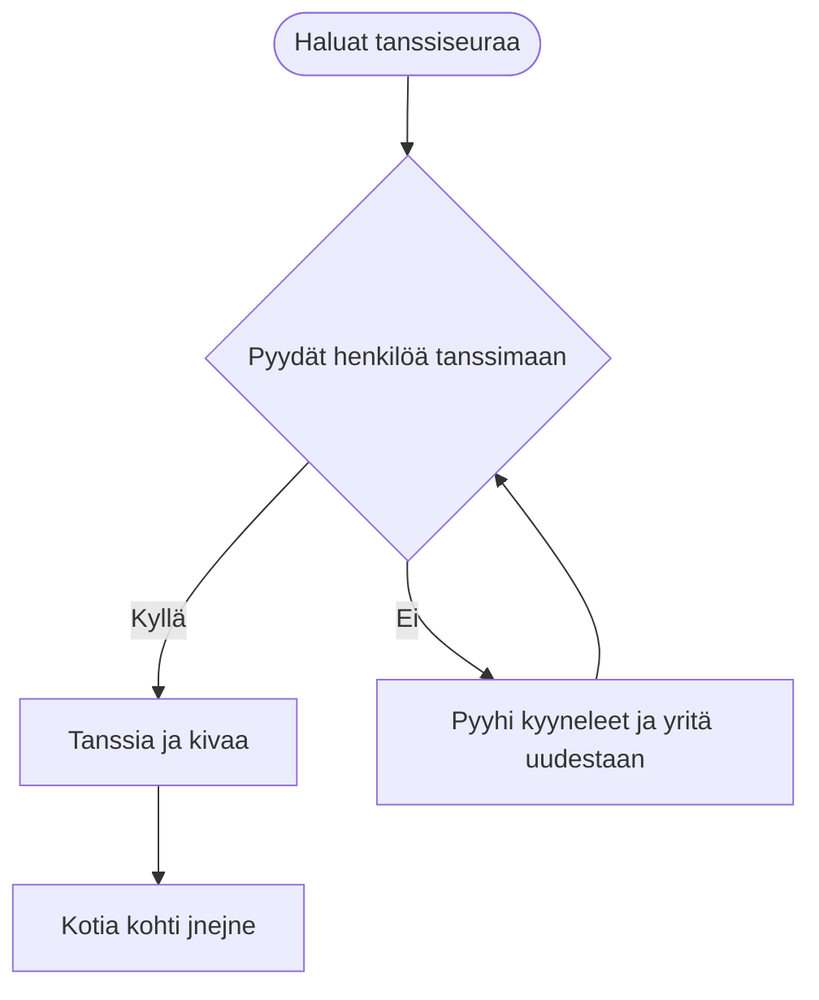
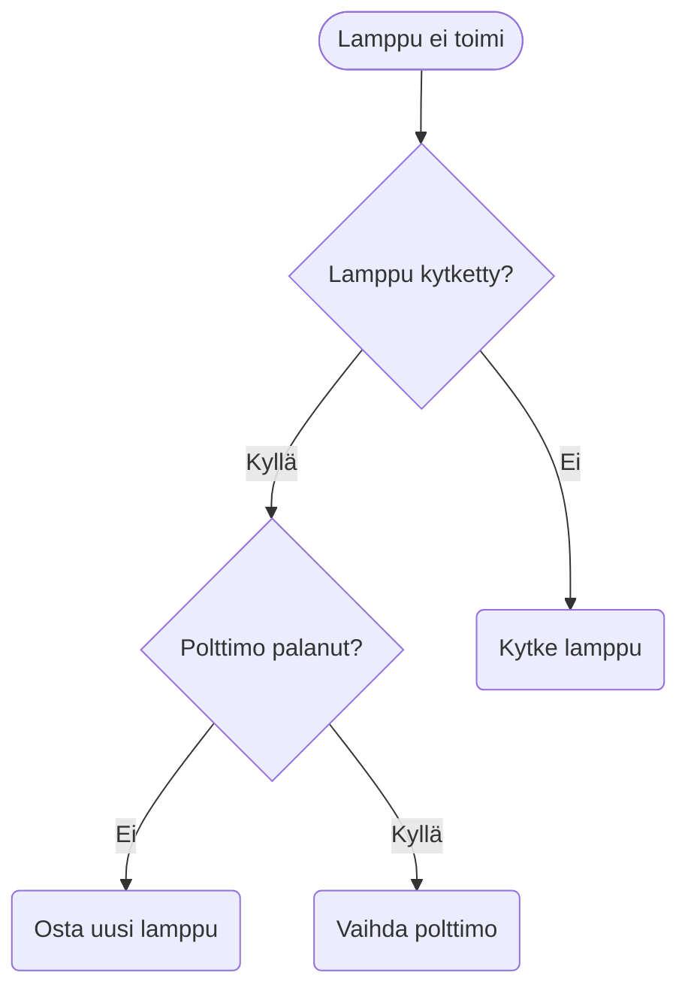
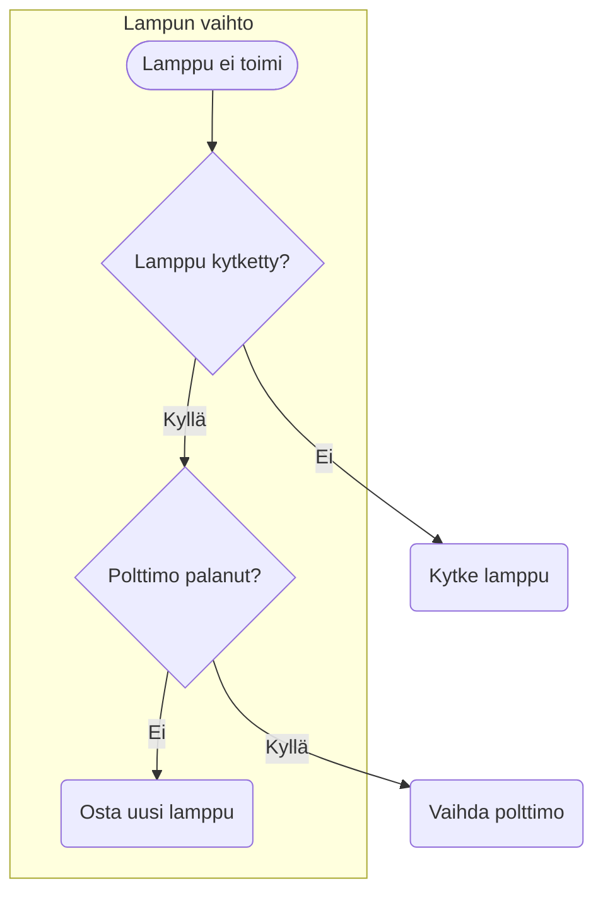

# vuokaaviot

## Tanssiseuran etsintä

```mermaid
graph TD;
  A([Haluat tanssiseuraa]) --> B{Pyydät henkilöä tanssimaan};
  B -- Kyllä --> C[Tanssia ja kivaa];
  C --> E[Kotia kohti jnejne];
  B -- Ei --> D[Pyyhi kyyneleet ja yritä uudestaan];
  D --> B;
  
  
```

## Lampun vaihto

```mermaid
graph TD;
  A([Lamppu ei toimi]) --> B{Lamppu kytketty?}
  B -- Kyllä --> C{Polttimo palanut?}
  C -- Ei --> D(Osta uusi lamppu)
  B -- Ei --> E(Kytke lamppu)
  C -- Kyllä --> F(Vaihda polttimo)
```

```mermaid
graph TD;
  subgraph Lampun vaihto
    A([Lamppu ei toimi]) --> B{Lamppu kytketty?} -- Kyllä --> C{Polttimo palanut?} -- Ei --> D(Osta uusi lamppu);
  end
  B -- Ei --> E(Kytke lamppu);
  C -- Kyllä --> F(Vaihda polttimo);
```

## Lomapäivä

```mermaid
graph TD;
  subgraph Lomapäivä
    A([Aloita]) --> B[Katso ulos ikkunasta] --> C{Sataako} --> |Ei| D[Mene rannalle] --> E([Lopeta]);
  end
  C --> |kyllä| F[Pysy kotona]
  F --> G([Lopeta])
```

